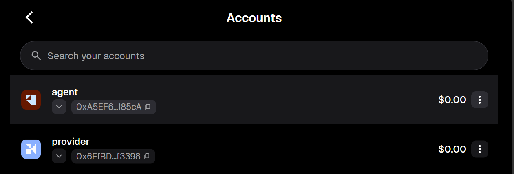
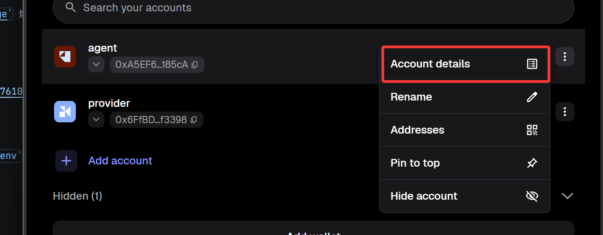
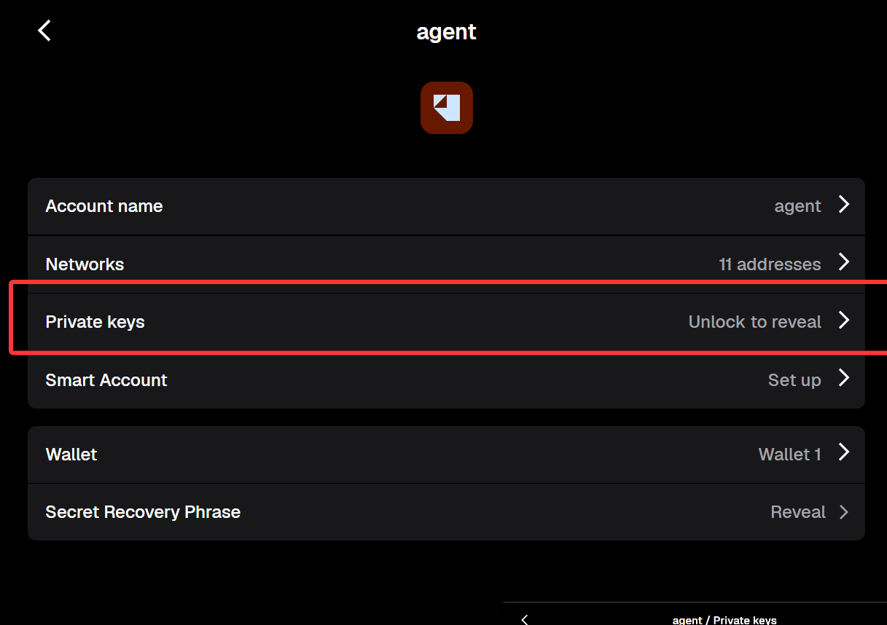
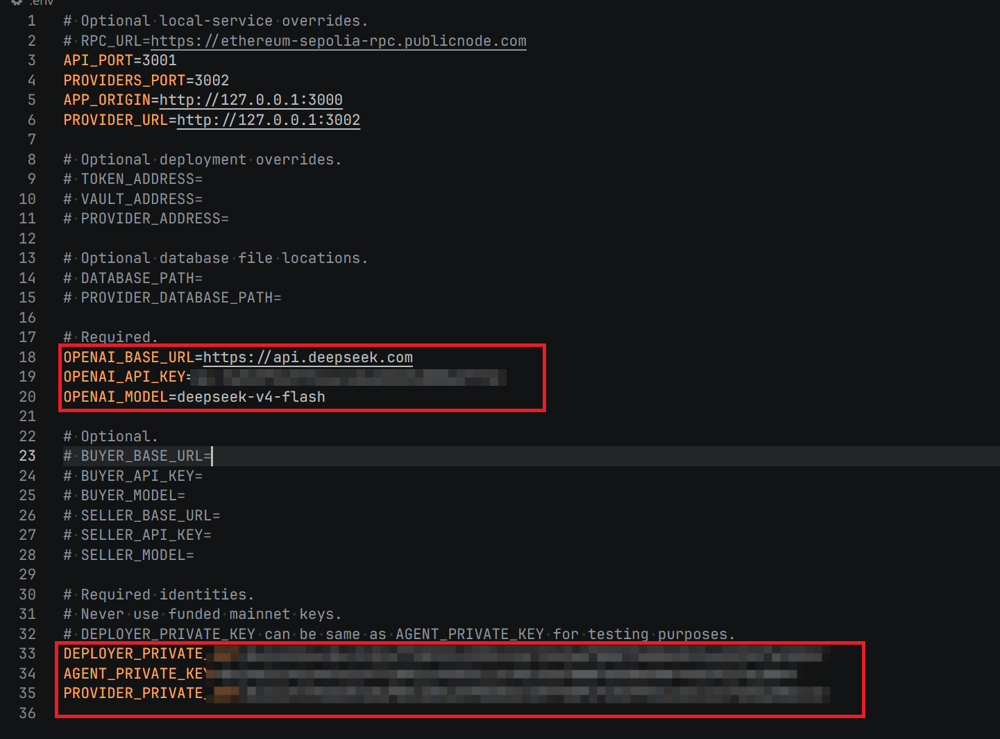
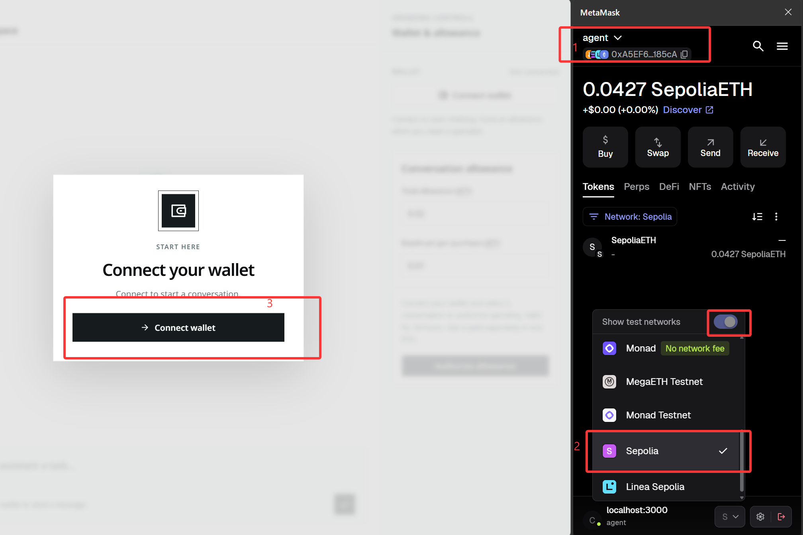

# Deployment guide

## 1. Set up wallets

### 1. Install a wallet and create accounts

Install a browser wallet extension and create a wallet. This guide uses MetaMask.

Create two accounts in MetaMask for the following roles. You can choose any names, as long as you can tell them apart.

| Account    | Purpose                                         |
| ---------- | ----------------------------------------------- |
| `agent`    | Used by the agent; needs Sepolia ETH            |
| `provider` | Used by the provider; does not need Sepolia ETH |



### 2. Get Sepolia ETH

Copy the `agent` account's wallet address.


Visit the [Google Cloud Sepolia faucet](https://cloud.google.com/application/web3/faucet/ethereum/sepolia) to get free Sepolia ETH.


### 3. Get the private keys

Open **Account Details** for each account and copy its private key for the environment configuration below.





## 2. Set up the AI service

Visit the [DeepSeek platform](https://platform.deepseek.com/usage), add credit, and get an API key.

## 3. Get the project

Clone the repository:

```sh
git clone https://github.com/Foahh/comp7610-agent-allowance
```

Open the cloned project folder in your preferred IDE.

## 4. Configure environment variables

### 1. Create the configuration file

Copy `.env.example` to `.env`, then fill in the fields below.



### 2. Configure the AI service

| Variable          | Value                                        |
| ----------------- | -------------------------------------------- |
| `OPENAI_BASE_URL` | DeepSeek API URL                             |
| `OPENAI_API_KEY`  | Your DeepSeek API key                        |
| `OPENAI_MODEL`    | Model name; recommended: `deepseek-v4-flash` |

Example:

```dotenv
OPENAI_BASE_URL=https://api.deepseek.com
OPENAI_API_KEY=sk-...
OPENAI_MODEL=deepseek-v4-flash
```

### 3. Configure wallets

Enter the private keys you copied earlier:

| Variable               | Value                                                                                     |
| ---------------------- | ----------------------------------------------------------------------------------------- |
| `DEPLOYER_PRIVATE_KEY` | Contract deployment account's private key; use the same key as `AGENT_PRIVATE_KEY`        |
| `AGENT_PRIVATE_KEY`    | The `agent` account's private key; this account must hold the Sepolia ETH claimed earlier |
| `PROVIDER_PRIVATE_KEY` | The `provider` account's private key; this account does not need Sepolia ETH              |

Example:

```dotenv
DEPLOYER_PRIVATE_KEY=0x...
AGENT_PRIVATE_KEY=0x...
PROVIDER_PRIVATE_KEY=0x...
```

## 5. Install dependencies

Follow the [official Vite+ installation guide](https://viteplus.dev/guide/).
Vite+ manages the runtime, so you do not need to install Node.js or pnpm separately.

After installation, open a new terminal and run this from the project root:

```sh
vp install
```

## 6. Deploy the smart contracts

Make sure the account for `DEPLOYER_PRIVATE_KEY` has Sepolia ETH, then run:

```sh
vp run @repo/contracts#build
vp run deploy:sepolia
```

## 7. Start the application

```sh
vp run db:init
vp run dev
```

Keep the terminal running. For later sessions, just run `vp run dev`.

## 8. Start using the application

Switch your wallet to Sepolia, select the `agent` account, and click **Connect wallet**. The account needs Sepolia ETH to pay transaction fees.



Claim ATT test tokens on the page, set a spending allowance, complete the authorization, and start chatting.
