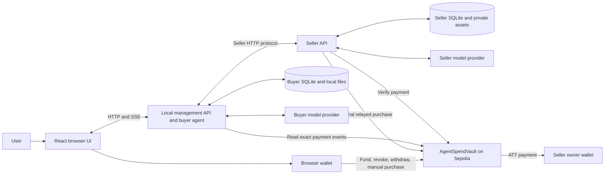
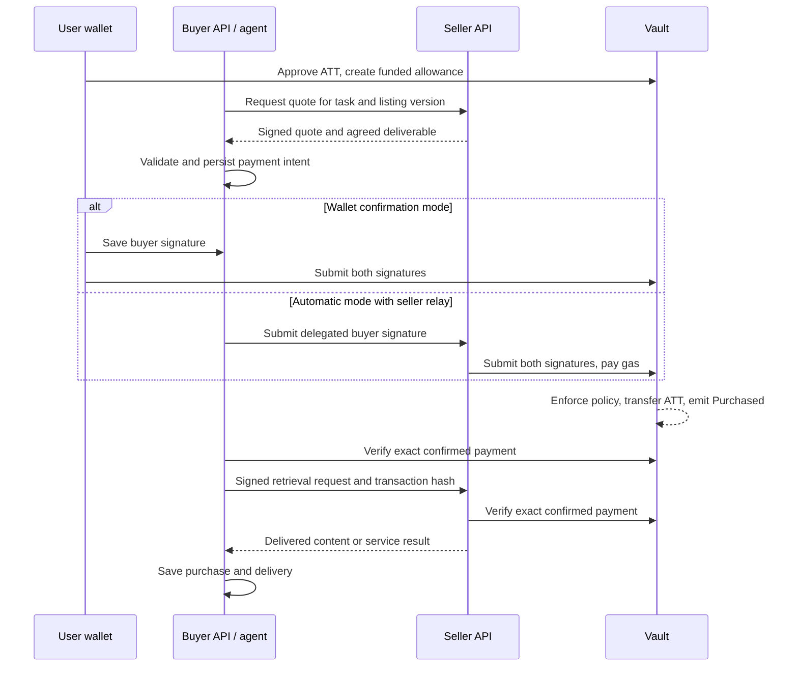

# Mandate: codebase study guide

Prepared for an eight-minute COMP7610 presentation covering the whole system.
Source baseline: `56d60f0`, inspected on 16 September 2026.

This guide explains the application logic, contracts, persistence, infrastructure, and tests. Generated route files and reusable UI primitives are supporting code rather than the core contribution. Technical claims below come from this checkout; design rationales are interpretations of the implementation. No live Sepolia purchase or paid model evaluation was performed during this study.

## 1. Understand the project in one sentence

**Mandate is a marketplace where an AI assistant can buy digital items and AI services within a spending allowance enforced by an Ethereum smart contract.**

The user decides the financial boundaries. The assistant discovers products, requests quotes, and invokes purchase tools. The seller supplies the item or executes an AI service after checking payment.

The academic problem is bounded delegation: how can a user let an AI take useful purchasing actions without granting unrestricted access to their wallet?

The strongest presentation argument is the separation of responsibilities:

- The model interprets language and chooses actions.
- Application code validates requests, manages identities, and handles retries.
- The contract enforces payment authorization and spending limits.
- The seller remains responsible for actual delivery and quality.

This is a working prototype and systems integration project. The code does not establish a novel consensus algorithm, a new language model, or a formal proof of AI safety.

## 2. Repository and runtime map

| Area                   | Responsibility                                                                    | First files to inspect                                      |
| ---------------------- | --------------------------------------------------------------------------------- | ----------------------------------------------------------- |
| Browser application    | Chat, wallet actions, seller catalog, listings, Library, Orders, Settings         | `main.tsx`, `routes/__root.tsx`, `hooks/use-assistant.ts`   |
| Management API         | Authentication, account/deployment selection, buyer agent, private administration | `installation.ts`, `app.ts`, `routes/conversations.ts`      |
| Seller API             | Public identity/catalog, quotes, relayed payment, authenticated fulfillment       | `seller-entry.ts`, `seller/routes/protocol.ts`              |
| Contracts              | ATT demonstration token and spending vault                                        | `AllowanceTestToken.sol`, `AgentSpendVault.sol`             |
| Shared schemas         | Runtime validation and inferred TypeScript types                                  | `packages/schemas/src/index.ts`, `marketplace.ts`           |
| Database               | SQLite schema, queries, migrations, payment journals                              | `packages/db/src/schema.ts`, `records.ts`, `marketplace.ts` |
| Shared utilities       | Hashes, typed signatures, chain clients, credentials, model adapters              | `chain.ts`, `config.ts`, `secrets.ts`, `model.ts`           |
| Development/deployment | Launch separate processes and deploy contracts                                    | `scripts/dev.ts`, `packages/contracts/scripts/deploy.ts`    |

The principal technologies are React 19, TanStack Router and Query, Hono, Valibot, the AI SDK, viem, SQLite with Drizzle, Solidity, OpenZeppelin, Hardhat, and Vite+. Versions are specified in the workspace catalog. You do not need to recite them in the presentation; explain the responsibilities first.



Each installation can act as both buyer and seller. Separate installations trade over HTTP while using the same chain, vault, and token. Seller discovery uses saved endpoints, not a global registry.

The launcher normally allocates three ports: browser, local management, and seller. Management is restricted to the local computer. The seller process listens on all IPv4 interfaces, exposes the seller routes, and checks whether remote access was enabled for the profile. This separation is deliberate: exposing a catalog should not expose private settings or model keys.

## 3. Follow one purchase from start to finish

Use this example: a user authorizes 5 ATT in total, a 2 ATT maximum per purchase, and seller A. The user requests seller A's 2 ATT dataset.

### Step 1: Sign in and choose a deployment

The browser connects a wallet and switches to Sepolia. The API issues a Sign-In with Ethereum message with a nonce and expiry. The wallet signs it; the API verifies it and creates an HTTP-only session cookie.

**Login proves identity. It does not authorize spending.**

The account runtime then selects that wallet's deployment profile. Deployment validation checks the network, addresses, token properties, token-to-vault binding, recent block, and deployed code against local contract artifacts. Imported code hashes alone are not trusted.

### Step 2: Connect the seller

`createSellerClient.inspect()` sends a fresh nonce and the advertised endpoint to the seller. The seller signs an identity message covering its endpoint, identity, chain, vault, and token. The buyer verifies either the owner's signature or a valid delegated seller signer.

The buyer saves the verified identity and public catalog. If a refresh finds a different seller address, the connection is disabled and requires reconnection. This proves control of the advertised signing identity, not that the seller is honest.

### Step 3: Fund the allowance

`fundAllowance()` can claim demonstration ATT if needed, obtains an ERC-20 approval, and calls `createAllowance()`.

These are distinct actions: ERC-20 approval lets the vault transfer tokens; allowance creation actually deposits the budget and records the policy.

The browser currently creates a 24-hour allowance. The contract accepts any future expiry. The API binds the on-chain allowance ID to a local conversation after checking ownership and the buyer signer. A conversation is an application concept; the contract only knows the numeric allowance ID.

### Step 4: Plan and obtain a quote

The model discovers connected listings. For multiple requested items it can save an ordered purchase plan. That plan is persistent progress data, not additional authority.

The task includes a listing ID, version, request ID, brief, evidence, and local seller connection ID. Static items already purchased from the same seller at the same version are reused. AI services are specific to their requested work.

The seller checks the listing and approved seller set, captures an execution snapshot, and interprets AI-service requests. Missing inputs produce a clarification rather than a payable quote.

The quote fixes the recipient, amount, allowance, listing commitment, requested work, nonce, and expiry. Current quotes expire after ten minutes. The seller signs it with EIP-712.

### Step 5: Validate and authorize

`assertPurchasableQuote()` checks the signatures and that the quote matches the conversation, allowance, listing version, task, deliverable, price, and remaining limits. Monetary calculations use integers.

The buyer then either waits for a wallet signature or signs using the delegated backend buyer key. It saves an authorization record, including the block from which payment recovery should search, before sending anything across the network.

### Step 6: Submit and settle

Either the browser wallet or the seller's optional relay sends `purchase(quote, sellerSignature, buyerSignature)` to the vault. The sender pays gas. The vault verifies both authorizations and all spending conditions, updates accounting, transfers ATT to the seller owner, and emits `Purchased`.

In the example, remaining funds become 3 ATT. Another 2 ATT purchase can fit; a third 2 ATT purchase cannot. An individual 3 ATT purchase also fails the 2 ATT cap, even if enough total funds remain.

### Step 7: Verify and deliver

The buyer and seller check the receipt for the exact `Purchased` event from the configured vault. The application waits for two confirmations on Sepolia; automated local-chain tests use one.

The buyer signs a short-lived delivery request. The seller verifies that the signer is the authorized delivery signer or allowance owner, checks payment, and then returns text, a link, a file, or an AI result.

### Step 8: Persist and reuse

Orders tracks payments and fulfillment. Library shows purchases whose payment is confirmed and delivery is completed. A paid item can be used in a later chat without another payment.



## 4. Know the identities and the two payment modes

| Role                     | Responsibility                                                                                   |
| ------------------------ | ------------------------------------------------------------------------------------------------ |
| Buyer owner              | Browser wallet that deposits the budget, revokes spending, and withdraws unused funds            |
| Buyer signer             | Authorizes each exact quote; either the owner wallet or a delegated backend key                  |
| Delivery signer          | Retrieves paid content; the UI assigns the backend buyer key in both modes                       |
| Seller owner / recipient | Receives ATT revenue and registers seller signing authority                                      |
| Seller signer            | Backend key that signs quotes and identity proofs; also sends transactions when relay is enabled |
| Transaction submitter    | Pays gas to submit already-authorized purchase data; need not be the buyer signer                |

These are roles, not necessarily six distinct addresses. In automatic mode, the buyer signing and delivery roles use the same backend buyer key. Backend keys are scoped to the account and deployment, rather than generated separately for every conversation.

| Question                                                        | Wallet confirmation mode         | Automatic mode                                   |
| --------------------------------------------------------------- | -------------------------------- | ------------------------------------------------ |
| Default?                                                        | Yes                              | User opts in before allowance creation           |
| Who signs the purchase authorization?                           | Owner wallet                     | Backend buyer key                                |
| Who normally submits it?                                        | Browser wallet                   | Seller relay, if enabled and funded              |
| Who pays purchase gas?                                          | Owner wallet                     | Seller relay account; browser wallet on fallback |
| Is the ATT budget enforced on-chain?                            | Yes                              | Yes                                              |
| Is content retrieval possible without another wallet signature? | Yes, through delivery delegation | Yes                                              |

The seller owner authorizes its signer on-chain. The current UI chooses a 30-day expiry; setting expiry to zero revokes it. Revenue goes to the seller owner, not the delegated signing account.

The relay is optional and initially disabled unless explicitly enabled in storage. Its policy limits maximum fee to 20 gwei, estimated gas to 300,000, worst-case cost to 0.002 ETH per transaction, and reserved cost to 0.01 ETH per UTC day. These are application policies, not vault spending rules. Gas is separate from ATT.

## 5. Understand the smart contract precisely

An allowance stores `owner`, `buyerSigner`, `budget`, `perPurchase`, `spent`, `expiresAt`, `revoked`, and `withdrawn`. Separate mappings store approved sellers, delivery signers, purchase IDs, and consumed nonces.

The central invariant is:

```text
remaining = budget - spent - withdrawn
0 < purchase amount <= perPurchase
purchase amount <= remaining
```

`createAllowance()` requires nonzero signers, 1–16 unique nonzero sellers, a positive budget, a positive cap no greater than the budget, and future expiry. It transfers the full budget into the vault.

`purchase()` performs these checks:

1. The buyer signature authorizes this quote under this vault's EIP-712 domain.
2. The allowance has not consumed the quote nonce.
3. The allowance is not revoked or expired.
4. The quote has a positive amount, has not expired, and pays an approved seller.
5. The seller signature belongs to the recipient or its currently authorized delegate.
6. The quote digest has not already been purchased.
7. Both the per-purchase and remaining-budget limits are satisfied.

It then records the purchase, increases `spent`, transfers ATT, and emits an event. Solidity transaction rollback means an invalid later check or failed transfer also reverses earlier state writes. OpenZeppelin's `SafeERC20` handles token transfer behavior and `ReentrancyGuard` protects guarded entry points. These protections come from established libraries integrated into the project's policy logic.

The buyer signature uses `BuyerAuthorization(quoteDigest)`, while the seller signs `Quote(...)`. Distinct types prevent substituting a seller signature for buyer consent. The domain contains the application name, version, chain ID, and vault address, so signatures are tied to that deployment.

`revokeAllowance()` stops future valid purchases once the revocation is included on-chain. It does not undo completed payments. `withdrawUnused()` requires the owner and a revoked or expired allowance, then returns the remaining deposit once. The UI currently exposes withdrawal after revocation even though the contract also permits it after expiry.

ATT is an ERC-20 demonstration token with six decimal places. One ATT equals 1,000,000 base units. Its unrestricted faucet mints 100 ATT per call; it has no demonstrated economic value or scarcity.

**The contract never evaluates whether the AI chose something useful or whether the seller delivered good work.** It sees hashes and payment policy, not the meaning of a conversation.

## 6. What the signatures and hashes prove

| Value                      | What it binds                                                                                        |
| -------------------------- | ---------------------------------------------------------------------------------------------------- |
| Listing content commitment | Serialized private listing and associated asset hashes                                               |
| `listingHash()`            | Listing ID, version, and content commitment                                                          |
| `taskHash()`               | Listing ID, version, request ID, brief, evidence, agreed deliverable, in fixed order                 |
| Quote digest / purchase ID | Allowance, listing commitment, task commitment, recipient, amount, nonce, expiry, and EIP-712 domain |
| Buyer authorization        | The exact quote digest under the same domain                                                         |
| Delivery authorization     | Purchase ID, chain, vault, purpose, and short expiry                                                 |

The local seller connection ID is not in `taskHash()`; the quote binds the seller through its recipient. The contract checks signatures over hashes, while the application recomputes hashes from actual data.

A hash is a commitment, not encryption and not a quality certificate. The public catalog omits paid content, seller instructions, API keys, and private asset text. The buyer checks downloaded bytes against the size and hash in delivery metadata and checks cached bytes again when reading. This detects corruption relative to that metadata; the current client does not reconstruct every private listing commitment or prove the truth of the delivered content.

## 7. The AI system: tool orchestration, not model training

`createAgent.run()` loads the conversation history, allowance, saved purchase plan, unresolved orders, and a Library index. It calls `streamText()` with five tools:

| Tool               | Purpose                                     | Directly creates a payment? |
| ------------------ | ------------------------------------------- | --------------------------- |
| `discoverListings` | Read saved, enabled, online catalogs        | No                          |
| `setPurchasePlan`  | Persist up to 16 requested tasks            | No                          |
| `requestQuote`     | Obtain agreed work and a signed price       | No                          |
| `purchaseQuote`    | Validate, authorize, and attempt a purchase | Potentially                 |
| `retrievePurchase` | Read an existing paid item                  | No                          |

The AI SDK supplies streaming, tool invocation, and structured-output mechanisms. Project-specific work defines the tools, prompts, validation, payment integration, and recovery behavior.

There is no fine-tuning pipeline or model training in this repository. `createModel()` uses the DeepSeek adapter for `api.deepseek.com`; other configured endpoints use an OpenAI-compatible chat adapter. The connection check exercises streaming, tool calls, and structured output.

Important bounds are implemented outside the prompt:

- Maximum 16 model steps, with a final text-only reply reserved when needed.
- At most two newly authorized purchases per agent run; parallel purchase-tool calls are serialized and counted from saved authorization results.
- An unresolved payment blocks authorization of a different purchase in that account/deployment runtime.
- A four-minute buyer-run abort signal and 200,000-character context checks.

The two-purchase cap is an agent-run rule, not an on-chain or universal API limit. The saved plan guides continuation, but the contract does not enforce plan membership. Prompt instructions such as treating seller content as untrusted improve behavior without proving resistance to prompt injection.

### Seller AI service

An AI-service listing specifies a model, instructions, required inputs, scope, deliverable, and selected knowledge assets. The seller first calls `interpretTask()` to clarify inputs or agree on a deliverable. After payment, `executeTask()` generates the actual response from the saved snapshot.

Selected text, Markdown, CSV, and JSON assets are inserted into the prompt. This is context supplied directly to the model; there is no vector database, embedding search, or retrieval-ranking pipeline here. Prompts request citations to asset names and row identifiers, but factual correctness is not independently verified.

The snapshot retains listing configuration, model configuration with encrypted credential, and selected asset text. Editing or unpublishing the listing later does not change the saved job. Static file jobs reference retained asset files, whose integrity is checked. A provider's remote model can still change; a snapshot does not make generation deterministic.

## 8. Payment and delivery are separate state machines

| Payment state | Meaning in the current flow                                                                                                                  |
| ------------- | -------------------------------------------------------------------------------------------------------------------------------------------- |
| `prepared`    | Record exists and the owner must authorize/submit in the wallet                                                                              |
| `pending`     | Authorization/submission exists but exact payment is not confirmed; a transaction hash may still be missing                                  |
| `confirmed`   | Exact successful purchase event verified with the required confirmations                                                                     |
| `rejected`    | Application rejected the attempt before successful authorization                                                                             |
| `reverted`    | Representable in the schema/UI; the current recovery path conservatively retains uncertain outcomes rather than assigning this automatically |

Delivery separately represents pending, running, completed, or failed. A confirmed payment with failed delivery is a meaningful state and has a specific UI label.

### Why retrying does not mean paying again

- Quote request identity: `(allowanceId, requestId)` returns the stored offer; different inputs with the same ID are rejected.
- Purchase identity: the signed quote digest identifies the payment record.
- On-chain replay protection: consumed nonce and purchase-ID mappings reject a second successful settlement.
- Recovery journal: the buyer saves the authorization and starting block before submission.
- Relay journal: the seller stores the signed raw transaction and its hash before broadcasting; it can rebroadcast the same transaction.
- Receipt recovery: a lost response is resolved by searching `Purchased` logs and matching all relevant quote fields.
- Delivery retries: reuse the paid job and saved snapshot, with no new payment request.

`createPurchaseExecutor()`, the payment queue, and seller in-flight maps serialize or coalesce work within a process. They are not a distributed lock service. The contract is the final authority against overspending across transactions.

The system does not claim exactly-once AI execution. A crash after an external model completed but before the result was stored can require execution again. That can consume more model-provider credit even though the ATT payment is not repeated.

Unknown payments are deliberately conservative: another purchase is blocked until reconciliation. The inspected recovery code does not include a complete abandonment/expiry-resolution workflow for every permanently unresolved authorization. This is a useful future-work point.

## 9. Data model and persistence

Each account/deployment runtime uses buyer and seller SQLite files. Authentication has its own installation session database. Files and encrypted credentials live in corresponding local directories.

SQLite is configured with write-ahead logging, foreign keys, and a five-second busy timeout. Startup applies the schema and migrates older purchase-plan storage inside a transaction; the current schema version is 3.

| Group                   | Main records                                                               | Why they matter                                                      |
| ----------------------- | -------------------------------------------------------------------------- | -------------------------------------------------------------------- |
| Chat                    | Conversations, messages, accepted runs                                     | History and duplicate message acceptance prevention                  |
| Authority mapping       | Allowance-to-conversation bindings                                         | Prevents local reuse of one allowance across different conversations |
| Planning                | Ordered purchase-plan rows                                                 | Stable progress across follow-up turns                               |
| Payment journal         | Immutable signed quotes, purchases, authorization, transaction/gas data    | Recovery and auditability                                            |
| Fulfillment             | Deliveries and ordered references                                          | Separates paid state from delivered state                            |
| Catalog                 | Listing heads, insert-only versions, published version, asset links        | Draft edits can coexist with an earlier published version            |
| Seller execution        | Quote request keys, execution snapshots, jobs                              | Stable quotes and fulfillment after edits                            |
| Connections             | Seller identities and cached public listings                               | Discovery and identity-change detection                              |
| Files                   | Private asset metadata, pinned purchase destination, downloaded file paths | Private storage and later retrieval                                  |
| Authentication/settings | Challenges, sessions, profile, models, operation records                   | Login, configuration, relay journals and policy                      |

Quotes retain a JSON snapshot alongside relational columns. Seller execution snapshots and generic operation records also use JSON. Therefore, describe this as relational storage with selected snapshots, rather than a completely normalized schema or a formal event-sourcing system.

Amounts are stored and transported as decimal strings and converted to `bigint` for payment logic. This avoids JavaScript floating-point precision problems and JSON's inability to encode `bigint` directly. Display copies format ATT separately without mutating signed inputs.

Deleting an order hides it using a tombstone while preserving its payment and fulfillment records. Deleting a conversation removes messages and its plan, but retains payment records and allowance bindings. Deletion is not an on-chain refund or cancellation.

## 10. Frontend reading guide

| Screen / component                    | What to understand                                                                            |
| ------------------------------------- | --------------------------------------------------------------------------------------------- |
| `AccountEntry`                        | Wallet connection, SIWE login, session restoration, account/network changes, cross-tab logout |
| Root workspace and `AssistantContext` | One shared controller coordinates the wallet and conversation UI                              |
| Assistant page                        | Chat history, streamed answer, allowance controls, purchase cards and saved plan              |
| Sellers                               | Save/refresh verified endpoints, view catalogs, request quotes manually                       |
| My listings                           | Create drafts, upload private assets, publish versions, preview AI services                   |
| Library                               | Completed paid items, content/file access, reuse in chat                                      |
| Orders                                | Purchase and sale history, retry/reconcile, payment receipt links                             |
| Settings                              | Deployment, models, seller profile/endpoint, signing authority, relay funding                 |

`useAssistantQueries()` loads durable data with TanStack Query. `useAssistantRun()` uses a reducer for temporary streamed text, status, errors, and purchase events. `useAssistant()` combines these with wallet actions and merges streamed purchases with saved records.

The API streams Server-Sent Events over a POST response; the browser reads the stream through `fetch()`. Events are `text`, `status`, `purchase`, `error`, and `done`. This is not a WebSocket connection.

Conversation details poll every ten seconds while work remains unresolved. Reads can reconcile an existing payment and trigger its delivery, but they do not create a new charge. A disconnected browser does not cancel a financial operation already running on the server.

`PurchaseCard` is shared across chat, purchasing, Library, and Orders. It makes the payment/delivery distinction visible and supplies wallet fallback and receipt access. Generic `components/ui` primitives and AI message-rendering components support presentation; start with the business components when studying.

## 11. Security and trust boundaries

| Concern                          | Implemented control                                                 | Practical boundary                                                   |
| -------------------------------- | ------------------------------------------------------------------- | -------------------------------------------------------------------- |
| Model overspending               | On-chain deposit budget, cap, seller allowlist, expiry              | Bad but authorized purchases can still consume the budget            |
| Forged or modified payment       | Two signatures, typed domain, task/listing commitments              | Contract does not interpret natural-language quality                 |
| Replay                           | Quote ID and allowance-scoped nonce checks                          | Does not prevent all repeated off-chain computation                  |
| Login replay                     | Browser-bound, expiring, one-use challenges                         | Session authentication is separate from on-chain authority           |
| Unauthorized management access   | Loopback restrictions, session checks, exact-origin mutation checks | Designed for local management rather than a hosted multi-tenant SaaS |
| Unpaid or unauthorized retrieval | Payment-event check and purpose-bound retrieval signature           | Seller must remain available and cooperative                         |
| Secret exposure                  | AES-256-GCM encryption, API returns `hasKey` rather than key        | Encryption key is also local; full host compromise remains serious   |
| Changed listings                 | Versioned catalog and execution snapshots                           | External model behavior and link destinations can change             |
| Corrupted files                  | Local asset and downloaded/cached file hash checks                  | Integrity is not content quality or copyright ownership              |
| Oversized input                  | Body/file/context bounds and timeouts                               | No broad public seller abuse-prevention system is demonstrated       |

Sessions have an eight-hour absolute lifetime and a thirty-minute inactivity limit. The runtime rechecks session authority before creating an automatic purchase authorization. Logout cannot invalidate an already signed purchase or revoke the contract allowance; on-chain revocation is the mechanism for stopping future settlement under that allowance.

Pre-quote AI interpretation can incur provider costs before payment. Seller HTTP routes have input-size controls, but do not show a general rate-limit/payment mechanism for every quote request. Public deployment would need additional abuse controls.

The chain contains amounts, addresses, allowance policies, hashes, and purchase events. It does not store the full chat, files, or generated answer. Hashes are public commitments, not a comprehensive privacy mechanism. Content may also be sent to the selected model provider.

## 12. Why these design choices make sense

| Choice                            | Benefit                                                                   | Cost or tradeoff                                             |
| --------------------------------- | ------------------------------------------------------------------------- | ------------------------------------------------------------ |
| Enforce budgets in a contract     | Independent enforcement even when application validation is bypassed      | Gas, confirmation delay, contract correctness requirements   |
| Deposit a bounded allowance       | Known maximum ATT exposure and simple accounting                          | User must lock funds and later withdraw unused balance       |
| Use signed off-chain quotes       | Agree on exact work before making a payment transaction                   | Signature, expiry, replay and recovery complexity            |
| Separate authorizer and submitter | Seller can pay gas while buyer retains control of the quote               | Relay funding and fallback handling                          |
| Keep content and AI off-chain     | Supports ordinary files and model execution without putting them on-chain | Delivery is not atomic with settlement                       |
| Use local SQLite                  | Straightforward per-installation setup and transactional journals         | Backup, availability and multi-process scaling concerns      |
| Reuse static purchases            | Avoids accidental repeat charges and supports later chats                 | Must correctly distinguish seller, version, and new AI tasks |
| Keep old versions/snapshots       | Preserves agreed work after listing edits                                 | More storage and retained credentials/data to manage         |

Describe blockchain's value narrowly: it provides shared, independently enforced settlement rules between separately run participants. It is not required for every marketplace, and it does not remove all trust from this one.

## 13. Tests and the evidence you can present

Validation performed on this checkout:

| Check                          | Result                                  |
| ------------------------------ | --------------------------------------- |
| `vp install`                   | Dependencies already up to date         |
| `vp check`                     | Passed formatting, lint and type checks |
| `vp run @repo/contracts#build` | Passed; contracts already compiled      |
| `vp test`                      | **88 passed across 17 test files**      |
| `vp run -r build`              | Passed; 7 of 8 tasks used Vite+ cache   |

The first restricted test run passed 77 tests but timed out in the two suites requiring contract compilation. Hardhat could not acquire its compiler-cache lock in that run. With normal cache access and installed Node 24.20.0 selected for the command, all 88 passed. This was a verification-environment issue, not evidence of 11 failing assertions.

Build output includes warnings for large frontend chunks and experimental TypeScript tooling. A cached successful build is not a clean-rebuild performance benchmark. No source fixes were required for this study.

The strongest test evidence is:

- Nine vault tests covering exact quote/vault authorization, seller delegation, total and per-purchase limits, unapproved sellers, altered/replayed/expired quotes, revocation/withdrawal, failed transfer rollback, and competing purchases.
- Two integration tests with separate installations, HTTP, temporary SQLite databases, and a local chain. They exercise text/link/file purchases, seller-paid gas with an unfunded buyer signer, duplicate reuse, reverse-role trading, and wallet-confirmed payment with delegated retrieval.
- Payment tests covering lost submission responses, restart recovery, unresolved-payment blocking, exact event matching, concurrent static-item reuse, and logout.
- Store, seller, route, deployment and agent tests covering snapshots, private catalog data, account isolation, permissions, migration rollback, purchase limits, and final-answer behavior.

Do not turn this into an unmeasured percentage claim. The suite is not a formal audit, a frontend browser test suite, a load test, or a live assessment of LLM answer quality. No measured latency, model accuracy, user-satisfaction improvement, or economic viability result was established here.

For future evaluation, measure purchase success rate, gas per operation, confirmation delay, model/tool success and cost, duplicate-charge behavior under injected network failures, and delivery quality against a defined rubric. These are proposed experiments, not current results.

## 14. Questions to rehearse

**Why combine AI and blockchain?**
The AI translates a task into purchases. The contract places enforceable limits on the resulting payments. Each handles a different part of the problem.

**Can the model steal the entire wallet balance?**
This payment path is limited to deposited allowances. A compromised delegated signer could authorize harmful purchases to approved recipients within active limits. It cannot use these contract functions to enlarge its allowance or withdraw as the owner.

**Why not just check the budget in JavaScript?**
Application checks give early feedback. The contract is the shared final check, including when an application is buggy or a caller submits directly.

**Is the project fully autonomous?**
It supports bounded automatic authorization, but wallet confirmation is the default. Automatic submission also requires the seller relay. Model-step, purchase-count and unresolved-payment limits can require user continuation.

**What happens if the seller takes payment and disappears?**
The current design cannot force fulfillment or refund the completed payment. Retry helps operational failures when the seller returns. Escrow with disputes or verifiable delivery would require additional design.

**Is the vault an escrow contract?**
It holds a prepaid spending allowance, but it does not hold each purchase payment until delivery approval. Payment is transferred immediately when the purchase succeeds.

**What prevents paying twice after a network error?**
The exact authorization is persisted; payment is recovered by its quote digest and matching event. The contract rejects replay. The client retries the existing purchase rather than blindly creating another charge.

**What is the difference between a request ID, quote nonce, and purchase ID?**
The request ID makes seller quote requests idempotent within an allowance. The nonce is random quote data tracked for on-chain replay prevention. The purchase ID is the domain-bound quote digest.

**Can a seller edit a product after I pay?**
It can publish later versions, but existing jobs retain their quoted listing/configuration snapshot. That protects configuration consistency, not a guarantee of model output quality or continued hosting.

**Where does the AI get its knowledge? Is this RAG?**
The seller includes selected readable assets and buyer evidence directly in the prompt. There is no embedding index or retrieval-ranking system in the current code.

**Who pays the AI provider?**
The owner of the configured provider API key incurs provider charges. ATT settlement is a separate demonstration payment mechanism; the contract does not directly reimburse provider bills.

**Does revoking the seller signer refund earlier sales?**
No. It prevents future acceptance of quotes signed by that delegate after revocation takes effect. Existing successful payments remain valid.

**Why separate payment status and delivery status?**
A blockchain transaction can succeed even if a later network request or model invocation fails. Separate state avoids misleading users and allows delivery retries without another payment.

**What is your team's contribution versus reused libraries?**
The project assembles allowance policy, buyer/seller orchestration, quote and delivery protocols, persistent recovery, marketplace versioning, and the UI. React, the AI SDK, viem, OpenZeppelin and the database tools provide underlying mechanisms. Allocate personal credit only according to the team's actual work; the checkout alone cannot establish individual ownership.

**What would you improve next?**
Fulfillment protection, robust unresolved-intent expiry handling, seller abuse controls, crash-safe job processing, better key storage, and an empirical quality/performance evaluation. Prioritize two or three in the presentation.

## 15. Read the source in this order

Study one path at a time. For each file, be able to explain its inputs, state changes, external calls, failure behavior, and output.

| Order | Source                                                                                                                                                                                                                                                                                                                                                                             | What you should be able to explain                            |
| ----- | ---------------------------------------------------------------------------------------------------------------------------------------------------------------------------------------------------------------------------------------------------------------------------------------------------------------------------------------------------------------------------------- | ------------------------------------------------------------- |
| 1     | [Project README](D:/project/comp7610-agent-allowance/README.md) and [deployment guide](D:/project/comp7610-agent-allowance/DEPLOY.md)                                                                                                                                                                                                                                              | Product goal and participant setup                            |
| 2     | [Shared schemas](D:/project/comp7610-agent-allowance/packages/schemas/src/index.ts) and [marketplace schemas](D:/project/comp7610-agent-allowance/packages/schemas/src/marketplace.ts)                                                                                                                                                                                             | Conversation, task, signed quote, purchase, delivery, listing |
| 3     | [Vault](D:/project/comp7610-agent-allowance/packages/contracts/contracts/AgentSpendVault.sol) and [ATT](D:/project/comp7610-agent-allowance/packages/contracts/contracts/AllowanceTestToken.sol)                                                                                                                                                                                   | Financial policy, replay protection, revoke/withdraw          |
| 4     | [Hash/signature helpers](D:/project/comp7610-agent-allowance/packages/utils/src/chain.ts)                                                                                                                                                                                                                                                                                          | How off-chain messages match Solidity                         |
| 5     | [Wallet actions](D:/project/comp7610-agent-allowance/apps/web/src/lib/wallet.ts)                                                                                                                                                                                                                                                                                                   | Funding and manual/automatic modes                            |
| 6     | [Buyer agent](D:/project/comp7610-agent-allowance/apps/api/src/lib/agent.ts), [prompts](D:/project/comp7610-agent-allowance/apps/api/src/lib/agent-prompts.ts), [purchase executor](D:/project/comp7610-agent-allowance/apps/api/src/lib/agent-purchases.ts)                                                                                                                       | Tool loop and enforceable versus prompt-only restrictions     |
| 7     | [Seller client](D:/project/comp7610-agent-allowance/apps/api/src/lib/seller-client.ts) and [quote validation](D:/project/comp7610-agent-allowance/apps/api/src/lib/quote-validation.ts)                                                                                                                                                                                            | Identity verification and exact work checks                   |
| 8     | [Payments](D:/project/comp7610-agent-allowance/apps/api/src/lib/payments.ts) and [recovery](D:/project/comp7610-agent-allowance/apps/api/src/lib/intent-recovery.ts)                                                                                                                                                                                                               | Write-before-submit and recovery after uncertain outcomes     |
| 9     | [Seller service](D:/project/comp7610-agent-allowance/apps/api/src/seller/lib/seller-service.ts), [relay](D:/project/comp7610-agent-allowance/apps/api/src/seller/lib/submitter.ts), [protocol routes](D:/project/comp7610-agent-allowance/apps/api/src/seller/routes/protocol.ts)                                                                                                  | Quote, settle, authenticate, deliver                          |
| 10    | [Marketplace](D:/project/comp7610-agent-allowance/apps/api/src/seller/lib/marketplace.ts) and [specialist](D:/project/comp7610-agent-allowance/apps/api/src/seller/lib/specialist.ts)                                                                                                                                                                                              | Listing versions, assets, snapshots, AI execution             |
| 11    | [Database schema](D:/project/comp7610-agent-allowance/packages/db/src/schema.ts), [record queries](D:/project/comp7610-agent-allowance/packages/db/src/records.ts), [catalog queries](D:/project/comp7610-agent-allowance/packages/db/src/marketplace.ts), [buyer store](D:/project/comp7610-agent-allowance/apps/api/src/lib/store.ts)                                            | What is durable and what deletion preserves                   |
| 12    | [Installation](D:/project/comp7610-agent-allowance/apps/api/src/installation.ts), [auth](D:/project/comp7610-agent-allowance/apps/api/src/routes/auth.ts), [deployment validation](D:/project/comp7610-agent-allowance/packages/utils/src/deployment.ts), [secrets](D:/project/comp7610-agent-allowance/packages/utils/src/secrets.ts)                                             | Identity, isolation, configuration and local trust            |
| 13    | [Conversation routes](D:/project/comp7610-agent-allowance/apps/api/src/routes/conversations.ts), [assistant controller](D:/project/comp7610-agent-allowance/apps/web/src/hooks/use-assistant.ts), [browser client](D:/project/comp7610-agent-allowance/apps/web/src/lib/client.ts), [purchase card](D:/project/comp7610-agent-allowance/apps/web/src/components/purchase-card.tsx) | How server state reaches the UI                               |
| 14    | [Contract tests](D:/project/comp7610-agent-allowance/packages/contracts/test/vault.test.ts) and [integration tests](D:/project/comp7610-agent-allowance/apps/api/src/marketplace.integration.test.ts)                                                                                                                                                                              | Concrete evidence for your claims                             |

Additional operational sources: [launcher](D:/project/comp7610-agent-allowance/scripts/dev.ts), [seller entry](D:/project/comp7610-agent-allowance/apps/api/src/seller-entry.ts), [model adapter](D:/project/comp7610-agent-allowance/packages/utils/src/model.ts), [model connection check](D:/project/comp7610-agent-allowance/apps/api/src/seller/lib/model-check.ts), [seller controls](D:/project/comp7610-agent-allowance/apps/web/src/components/seller-operations.tsx), and [demo items](D:/project/comp7610-agent-allowance/apps/api/src/seller/lib/demo-items.ts).

## 16. A study session you can actually complete

1. **20 minutes: architecture.** Read sections 1–4 and draw the actors without looking.
2. **30 minutes: money.** Trace `fundAllowance()` → `purchase()` → `withdrawUnused()`. Explain the 5 ATT / 2 ATT example aloud.
3. **25 minutes: agent and seller.** Trace all five tools and distinguish quote interpretation from paid execution.
4. **25 minutes: failure handling.** Explain a lost transaction response, failed delivery, repeat quote, and changed listing.
5. **20 minutes: evidence and limitations.** Read the named tests and answer the questions in section 14.
6. **Two timed rehearsals.** Use the eight-minute companion document. Keep filenames and implementation details for questions unless they support a slide's main claim.

You are ready when you can explain both a successful purchase and a failed purchase without saying simply "the AI handles it" or "the blockchain makes it secure."
