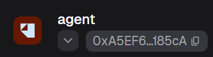
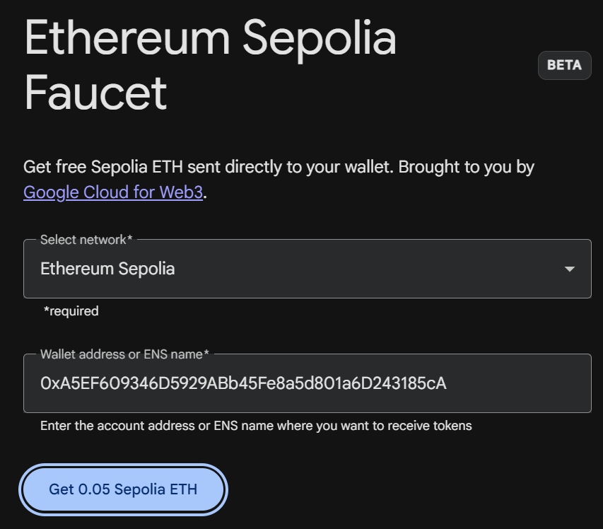

# 部署指南

## 一、准备钱包

安装 MetaMask 等浏览器钱包，创建账户，并切换到 **Ethereum Sepolia**。

复制钱包地址，前往 [Google Cloud 水龙头](https://cloud.google.com/application/web3/faucet/ethereum/sepolia)免费领取 Sepolia ETH。





## 二、准备 AI 服务

前往 [DeepSeek 开放平台](https://platform.deepseek.com/usage)，爆米并获取 API Key。

## 三、获取项目

```sh
git clone https://github.com/Foahh/comp7610-agent-allowance
cd comp7610-agent-allowance
```

使用你熟悉的 IDE 打开项目文件夹。

## 四、安装依赖

按照 [Vite+ 安装指南](https://viteplus.dev/guide/)完成安装，然后在项目根目录重新打开终端：

```sh
vp install
```

## 五、部署智能合约（可选）

准备好群聊文件中的 `deployment-11155111.json`，
否则，将 `.env.contract.example` 复制为 `.env.contract`，然后运行：

```sh
vp run @repo/contracts#build
vp run deploy:sepolia
```

如提示余额不足，向显示的部署账户地址转入 Sepolia ETH。

## 六、启动应用

```sh
vp run dev
```

打开终端显示的网址，并保持终端运行。启动器会自动配置端口和初始化数据库。

连接钱包并签名登录。导入部署 JSON，点击 **Validate network and contracts**，再点击 **Save this deployment**。互相交易的参与者必须使用同一套合约。

## 七、配置 DeepSeek

在 **Settings** 填写 DeepSeek 接口地址、模型名称和 API Key，点击 **Check connection**，再选择买方默认模型。

## 八、开始使用

在 **Connected sellers** 添加其他参与者的完整卖方端点。创建聊天，按提示领取测试 ATT 并授权消费预算，购买时在钱包中确认。

如需出售商品，在 Settings 点击 **Authorize seller signer**，然后在 **My listings** 发布商品。
